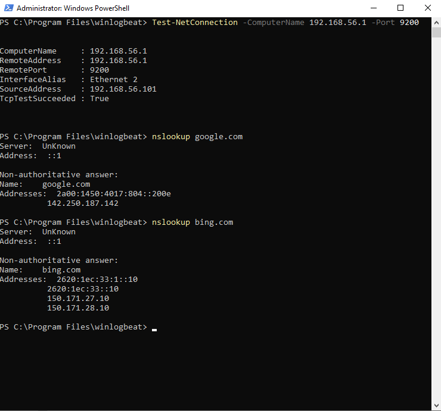

# Windows Threat Detection & SOC Lab

## 🎯 Overview
This project demonstrates the setup of a Security Operations Center (SOC) home lab. It focuses on endpoint monitoring, log ingestion, and threat detection using the Elastic Stack and Winlogbeat

## 🛠️ Tools Used
* **SIEM:** Elastic Stack (Elasticsearch & Kibana)
* **Endpoint Telemetry:** Microsoft Sysmon
* **Log Shipper:** Winlogbeat
* **Environment:** Kali Linux (Host) & Windows Server 2022 (VM)

## 📡 Network Configuration
To ensure stable communication between the Windows endpoint and the SIEM, a **Host-only Network** was implemented
* **Elasticsearch IP:** `192.168.56.1`
* **Connectivity Test:** Verified via `Test-NetConnection` on port 9200

## 🛡️ Detection Capabilities
I developed custom Sysmon and Winlogbeat configurations to detect:
1. **C2 Communication:** Monitoring DNS queries and network connections (Event ID 3)
2. **Persistence:** Tracking registry modifications in `Run` keys (Event ID 13)
3. **Process Monitoring:** Tracking process creation and termination (Event ID 1 & 5)

## 📊 Results
The lab successfully captured real-time events. Below is a spike in traffic during a simulated DNS beaconing attack:

### 📈 SOC Monitoring Dashboard
Below is the overall visualization of the ingested telemetry, showing top processes and event distributions:

